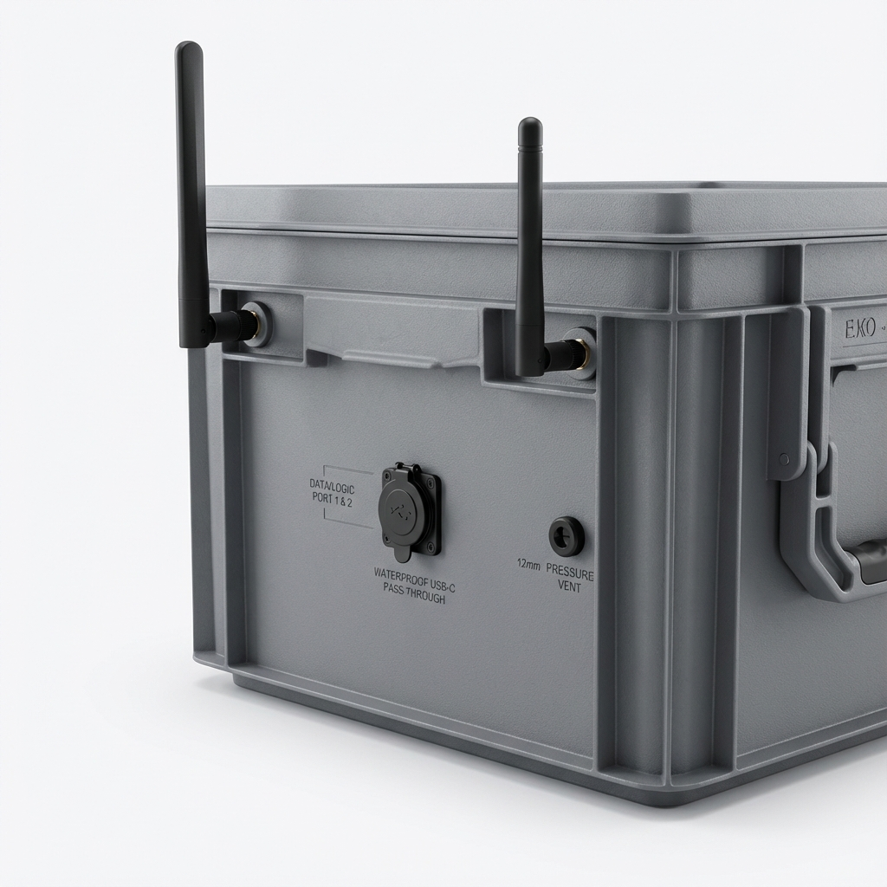

# 📐 Mechanical Layout Plan

**Part Specification**: 3D Printed Modular Plate (PETG/ASA)
**Total Size**: 550mm x 350mm (Split into segments for printing)
**Orientation**: Horizontal (Landscape) inside Rako box.

## Design Philosophy: "Clean Deck"
- All cables disappear immediately through holes near the components to the "Underdeck".
- High Power (12V) on the RIGHT side (nearer to cable glands usually).
- Logic (5V/Data) on the LEFT side.
- Airflow: Components spaced out.

## ASCII Layout Map

```text
       [   LEFT: 550mm   ]                                     [ RIGHT ]
  +-----------------------------------------------------------------------+
  |                                                                       |
  |   [ WIFI ANT  ]         [  SSD DRIVE  ]          [ MPPT CONTROLLER ]  |
  |     (Atheros)            (Velcro/Screw)             (Vertical Mount)  |
  |                                                                       |
  |                                                                       |
  |   [ RASPBERRY PI 4 ]    [  Heltec LoRa ]         [ FUSE UNIT ]        |
  |     (Armor Case)         (Stick/Case)             (Distributor)       |
  |                                                                       |
  |                         [ RTC / INA219 ]                              |
  |                          (Sensor Cluster)                             |
  |                                                                       |
  |                                                  [ MAIN SWITCH ]      |
  |                                                   (Panel Mount)       |
  |                                                                       |
  +-----------------------------------------------------------------------+
```

## Drilling & Mounting Guide

### 1. General Mounting Strategy
- **Material**: Printed in PETG or ASA to withstand summer temperatures inside the box.
- **Fasteners**: Use **M2.5/M3 Heat-Set Inserts** for all component mounts. Do not use self-tapping screws directly into plastic for frequently removed parts.
- **Segmentation**: The plate is likely printed in 2-4 sections (e.g., Dovetail or bolted joints) depending on printer volume (Voron 350 vs Prusa MK3).

### 2. The "Power Zone" (Right)
- **MPPT Controller**: Needs airflow. Mount slightly elevated.
- **Main Switch**: The printed plate should have a pre-modeled 20-23mm hole (check datasheet) or a snap-in rectangular cutout depending on the switch type.
- **Cable Pass-throughs**: Model these directly into the print with chamfered edges to protect cables.

### 3. The "Logic Zone" (Left/Center)
- **Raspberry Pi**: Use M2.5 heat-set inserts.
    - *USB*: Orientation matters! Point USB ports towards the "Cable Highway".
- **SSD**: Velcro is best for vibration dampening, or specific 3D printed cage.
- **Heltec LoRa**:
    - **Mounting**: **3D Printed Case** attached via **High-Temp Velcro / 3M Dual Lock**.
    - *Why*: Allows rapid field replacement of the unit without tools.
    - *Note*: Do not use standard sticky tape; use heat-resistant adhesive pads.

### 4. The "Cable Underworld" (Bottom side)
- Integrated cable tie anchors (zip tie slots) should be part of the print design.
- Run the 12V rails (Solar, Battery) along the edges.

## Dimensions Checklist
- **Pi 4**: ~88 x 58 mm
- **SSD**: ~100 x 70 mm
- **MPPT**: Victron SmartSolar 100/20 is approx. 100 x 113 x 40mm. Make sure to check the specific CAD model.

## 🕳️ External Rako Box Penetrations



These are the drill holes required in the **grey plastic box itself**.
*Caution: Ensure holes are positioned below the stacking rim and clear of the handle recesses.*

### 1. Left Flank ("Data Zone")
*Position: Aligned with Internal Logic (Pi, LoRa, WiFi)*


- **2x SMB/SMA Antenna Mounts (LoRa & WiFi)**:
    - *Purpose*: External High-Gain Antennas.
    - *Hole*: 6.5mm (SMA) or 16mm (N-Type).
    - *Location*: Top corners (spaced apart).
- **USB Waterproof Pass-through**:
    - *Purpose*: External Data/Console access.
    - *Hole*: ~25mm (check diameter).
    - *Location*: **Mid-Section** (Elevated ~15cm from bottom) to protect against standing water.
- **Waterproof Vent Plug**:
    - *Purpose*: Passive cross-ventilation (Inlet).
    - *Hole*: 12mm (M12).
    - *Location*: **Mid-Height**, ~5cm from front edge.

### 2. Right Flank ("Power Zone")
*Position: Aligned with Internal Power (MPPT, Battery, Fuse)*


- **Solar Input (XT60E-F)**:
    - *Purpose*: Connect Solar Panel.
    - *Hole*: Rectangular/Oval cutout (approx. 25mm x 15mm).
    - *Location*: High up, near MPPT.
- **Waterproof Vent Plug**:
    - *Purpose*: Passive cross-ventilation (Outlet).
    - *Hole*: 12mm (M12).
    - *Location*: ~5cm from back edge.
