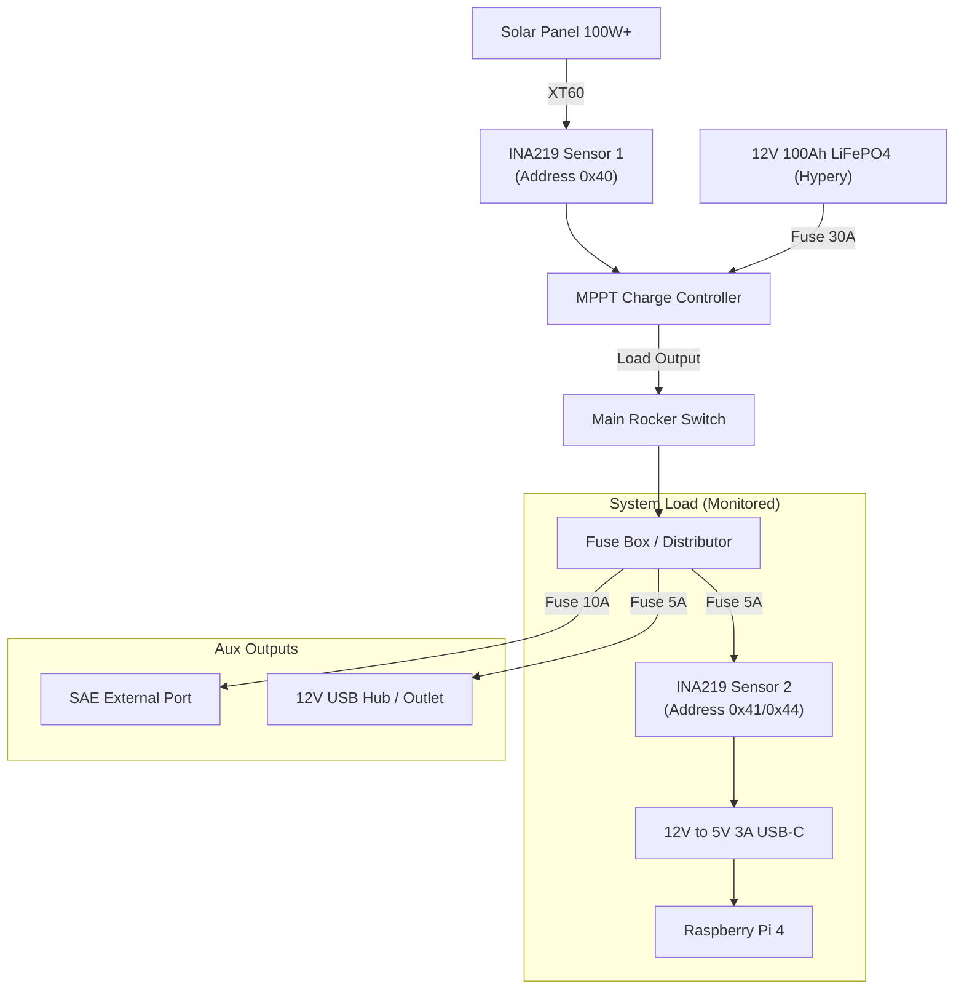

# 🔌 Wiring Schema - Le Réduit

## ⚡ Power Distribution Topology (12V Base)

The system uses a **Central Post** topology. All main loads connect to the Load Output of the MPPT controller (if current limit permits) or directly to the battery with a low-voltage disconnect (LVD). *Note: Most MPPT Load outputs are limited (e.g., 20A). Ensure total draw is within limits. The Pi and Accessories are fine.*

> [!WARNING]
> **Voltage Check**: The solar panel voltage (Voc) MUST NOT exceed 26V, or the INA219 sensor will be destroyed.

## 📍 Raspberry Pi 4 Pinout

We use the GPIO header for I2C (Sensors & RTC) and Setup Buttons.

| Pin | GPIO | Function | Connection | Note |
| :--- | :--- | :--- | :--- | :--- |
| 1 | 3.3V | 3.3V Power | INA219 VCC, DS3231 VCC | Logic Voltage (NOT 5V!) |
| 3 | GPIO 2 | **SDA** (I2C) | INA219 SDA, DS3231 SDA, BE-880 SDA | I2C Data Bus |
| 5 | GPIO 3 | **SCL** (I2C) | INA219 SCL, DS3231 SCL, BE-880 SCL | I2C Clock |
| 6 | GND | Ground | All GNDs | Common Ground |
| 7 | GPIO 4 | **1-Wire** | DS18B20 Data | Requires 4.7kΩ Pull-Up Resistor between 3.3V and Data |
| 8 | GPIO 14 | **TXD** (UART) | BE-880 RX | GPS Data Receive |
| 10 | GPIO 15 | **RXD** (UART) | BE-880 TX | GPS Data Transmit |
| 11 | GPIO 17 | **Intrusion** | MC-38 Reed Switch | Connect between GPIO 17 & GND (Internal Pull-Up enabled) |
| 13 | GPIO 27 | **Buzzer** | Active Buzzer (+) | Connect (+) to GPIO 27, (-) to GND |
| 9 | GND | Ground | Button GND | |
| 39 | GND | Ground | | |
| 5V | 5V | 5V Power | Fan (Optional), BE-880 VCC | GPS needs 5V (mostly) or 3.3V check spec |
| 37 | GPIO 26| Shutdown | Button (NO) | Connect between GPIO 26 & GND |

### I2C Address Map
The I2C bus allows multiple devices. They need unique addresses.
- **0x40**: INA219 **Sensor 1** (Solar Input) - Keep Default (No Solder).
- **0x41**: INA219 **Sensor 2** (System Load) - **SOLDER BRIDGE A0**.
- **0x68**: DS3231 Real Time Clock (Fixed Default)
- **0x69**: MPU6050 (Accelerometer) - **REQUIRED**: Connect **AD0** pin to **3.3V** to set this address.
- **0x1E**: BE-880 Internal Compass (HMC5883L)
- **0x23**: BH1750 Light Sensor (Default)
- **0x76** or **0x77**: BME280

## 📡 Data Connections (USB)
To avoid interference between USB 3.0 (high frequency noise) and 2.4GHz devices (though we use 868MHz/5GHz mostly), spacing matters.

- **USB 3.0 (Blue)**: 
    - Top: SSD Adapter
    - Bottom: Heltec LoRa V3 (RNode) - **Own SMA Antenna**
- **USB 2.0 (Black/White)**: 
    - Top: Atheros AR9271 WiFi (External connection via extension recommended)
    - Bottom: Heltec LoRa V3 (Meshtastic) - Shared/Main Antenna
